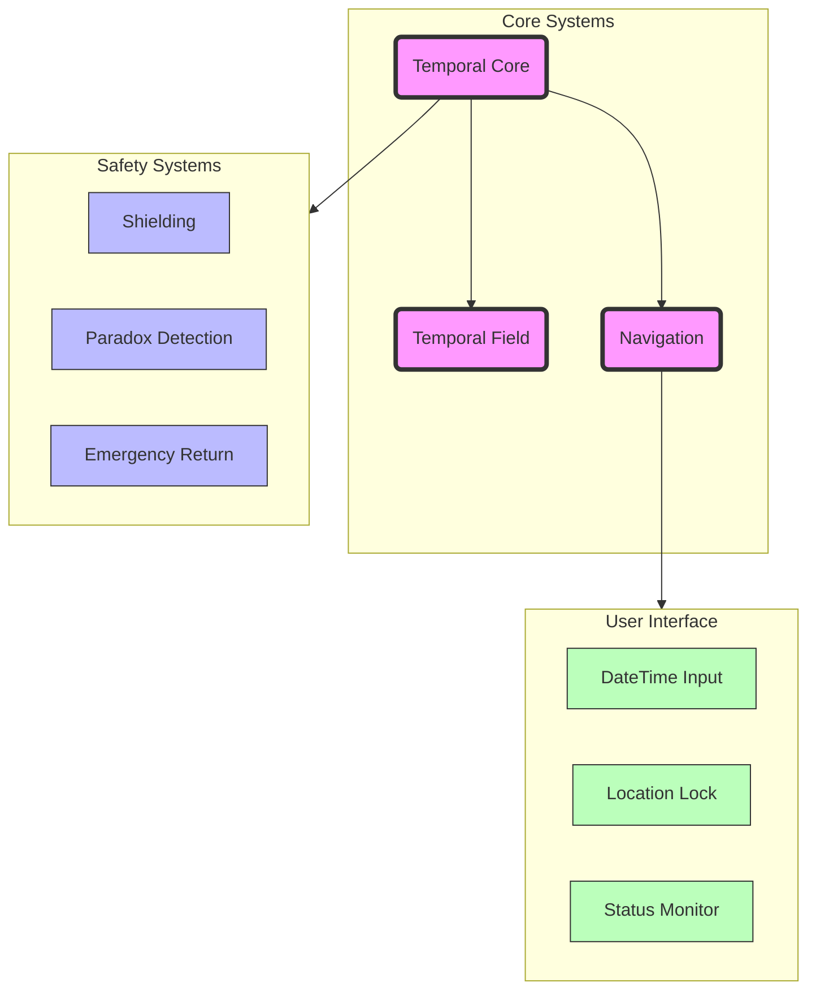

# 

Let me help you design a Minimum Viable Product (MVP) for a time machine. I'll focus on the essential features that would make it functional while keeping it as simple as possible.

Essential MVP Features:

1. Temporal Core System
- Single-occupant temporal field generation
- Limited range: ±50 years initially for safety and power constraints
- Automated temporal stabilization to prevent timeline fractures

2. Basic Safety Features
- Temporal shielding to protect the traveler
- Emergency return system with redundant power supply
- Basic paradox detection and prevention
- Automatic abort if critical systems fail

3. Streamlined Interface
- Simple datetime input system
- Location anchoring to prevent spatial displacement
- Real-time status monitoring
- Emergency stop button

4. Power Requirements
- Quantum vacuum energy harvesting
- Backup power cells for emergency return
- Power consumption optimization algorithms

Critical MVP Limitations:
- One-way travel initially (return to origin point only)
- Maximum 24-hour stay in any temporal location
- Fixed spatial coordinates during temporal transition
- No biological material transport other than the operator

Development Priorities:
1. Establish stable temporal field
2. Perfect safety systems
3. Implement basic navigation
4. Test with inanimate objects
5. Conduct short-range temporal jumps

Would you like me to elaborate on any of these components or discuss specific technical challenges we should address first?
``
